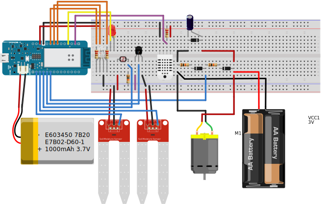

# Arduino Bonsai

I have been meaning to get a desk plant for a long time and I have always liked the
aesthetics of bonsai trees being sculpted into living artworks.

I have also been wanting to generate a dataset that I care about and have some sort
of investment in to nurture my hobby interest of data science and data visualisation.

So one day whilst I was installing tap timers and a drip irrigation system for my
garden to optimize for the least effort to maintain I realised that with the 
proliferation of hobby microcontrollers I could fuse those hobbies and have
the most overengineered desk plant.

I chose the Arduino MKR 1000 since it came in a beginners bundle, it is a very
small form factor compared to the UNO or the Raspberry Pi and it came with a WiFi
shield builtin.

The naming convention comes from characters from [Brooklyn Nine-Nine](http://www.imdb.com/title/tt2467372/).

----

## ~~Terry Jeffords - Juniperus~~

----

## Charles Boyle - Ficus

----

## Gina Linetti - Serissa Japonica

----

# Getting Started

## Getting Connected

 1. Download the [Arduino IDE](https://www.arduino.cc/en/Main/Software)
 1. Follow the [MKR 1000 Getting Started Guide](https://www.arduino.cc/en/Guide/MKR1000)
 1. In the Arduino IDE go to Tools > Boards > Arduino/Genuino MKR1000
 1. I'm on macOS High Sierra 10.13.3 with USB-C -> USB-A hub. Under Tools > Ports the MKR 1000 came up as `/dev/cu.usbmodem14121 (Arduino/Genuino MKR1000)`. Select this.

## Update WiFi Firmware

1. In the Arduino IDE Sketch > Include Library > Manage Libraries. Then in the search type `101`.
1. Install the latest WiFi101 by Arduino (0.15.2 at time of writing)
1. File > Examples > WiFi101 > FirmwareUpdater
	- It is important that the code on the board is the FirmwareUpdater code for the next steps.
1. Verify. Upload
1. Tools > WiFi Firmware Updater
1. Select from the list the port your MKR1000 is on. (eg, `/dev/cu.usbmodem14121`)
1. Test Connection.
1. Select latest WiFi firmware and Update Firmware.

[FirmwareUpdater](https://www.arduino.cc/en/Tutorial/FirmwareUpdater)

----

# Project

Since Arduino is open source I'm going to do my best to keep this project and it's 
stages as transparent as possible to enable others to learn and replicate.

## Schematic

As is standard in the Arduino community I am using the [Fritzing](http://fritzing.org/home/) 
software to document the circuit designs.

## Task Status

 - Sensors
    - [x] Moisture
    - [x] Temperature
    - [ ] Light
 - Display	
    - [x] LEDs
    - [ ] LCD
 - Cloud  / Network
    - [x] WiFi Connect to Network
    - [ ] Local Network interface
    - [ ] API endpoint to accumulate measurements (Heroku?)
    - [ ] Transmit measurements via WiFi to API
 - Security (The S in IoT)
    - [ ] Transmission Security (HTTP/SSL)
    - [ ] API Security - Certificate signed requests
    - [ ] Plan for rolling out firmware updates
    - [ ] Physical Device Security
 - Power
    - [x] Run off battery 
    - [ ] Measure battery 
    - [ ] Research battery saving techniques 

## Materials

 - AU$124.91  [Arduino MKR IoT Bundle](https://store.arduino.cc/usa/arduino-iot-mkr1000-bundle) including postage from USA to AUS and international transaction fees.
 - AU$ 15.86 (2x AU$7.93) [Soil Moisture Sensor (Arduino Compatible) Immersion Gold](https://core-electronics.com.au/soil-moisture-sensor-arduino-compatible-immersion-gold.html)
 - AU$ 13.95 [Polymer Lithium Ion Battery (LiPo) 3.7V 1000mAh](https://core-electronics.com.au/polymer-lithium-ion-battery-1000mah-38458.html)
 - AU$ 15.98 2015 3-inch Juniperus Squamata Prostrata bonsai
 - AU$  1.25 150mm plastic saucer

TOTAL(so far): AU$ 171.95

----

# Resources

 - [Arduino](https://www.arduino.cc/en/Main/Software)
 - [Core Electronics](https://core-electronics.com.au/tutorials)
 - [Getting Started with MKR1000 by Dr. Charif Mahmoudi](https://create.arduino.cc/projecthub/charifmahmoudi/arduino-mkr1000-getting-started-08bb4a)
 
 - [Plant Monitor](https://www.youtube.com/watch?v=URv7bfEuxDg)
 - [How to conserve battery life](https://core-electronics.com.au/videos/how-to-conserve-battery-life-with-iot-projects)
